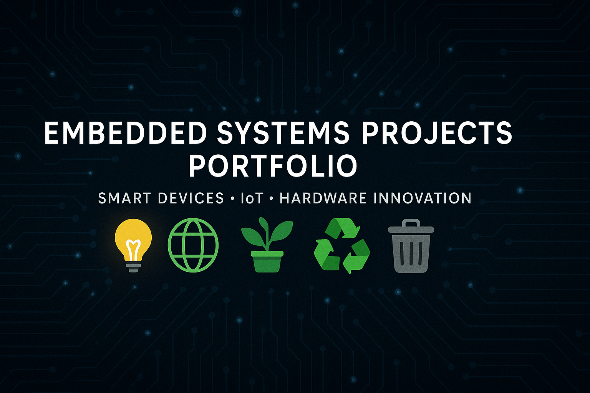

  

# 🌍 Embedded Systems Projects Portfolio  

Welcome to my **Embedded Systems Projects Portfolio** 🚀.  
This repository contains 5 projects demonstrating my skills in **embedded systems, IoT, and hardware prototyping**.  

---

## 📌 Projects  

### 1. [Smart Lighting System](./Project-1-Smart-Lighting-System) 💡  
Automated lighting using LDR & motion sensors for energy saving.  
- 🛠 Arduino + LDR + PIR Motion Sensor + Relay Module  
- 🎥 [Demo](./assets/smart-lighting-demo.mp4)  

---

### 2. [Environmental Monitoring System](./Project-2-Environmental-Monitoring) 🌍  
Real-time gas detection and cloud integration.  
- 🛠 Arduino + Gas Sensors + Wi-Fi  
- 🎥 [Demo](./assets/environmental-monitoring-demo.mp4)  

---

### 3. [Metal Detector Waste Bin](./Project-3-Metal-Detector-Waste-Bin) 🗑️  
Smart bin that separates metallic waste for recycling.  
- 🛠 Arduino + Metal Detection Module + Servo  
- 📷 [Circuit Diagram](./assets/metal-bin.png)  

---

### 4. [IoT-Based Greenhouse System](./Project-4-IoT-Greenhouse) 🌱  
Smart greenhouse with sensor-based monitoring and IoT dashboard.  
- 🛠 ESP32 + DHT11 + Soil Moisture Sensor + Cloud  
- 🎥 [Demo](./assets/greenhouse-demo.mp4)  

---

### 5. [Smart Waste Bin](./Project-5-Smart-Waste-Bin) ♻️  
Hands-free waste bin with ultrasonic sensor for hygiene.  
- 🛠 Arduino + Ultrasonic Sensor + Servo Motor  
- 📷 [Hardware Setup](./assets/smart-bin.png)  

---

## ⚡ Skills Demonstrated  
- **Programming**: C++, Arduino IDE  
- **Electronics**: Sensors, actuators, circuit design  
- **Protocols**: GPIO, UART, I²C, SPI  
- **IoT**: Real-time monitoring, cloud integration  
- **System Design**: Documentation, flowcharts, architecture  

---

## 📜 License  
This repository is licensed under the MIT License – feel free to use and learn from these projects.  

---
✨ *Built with curiosity, creativity, and a passion for embedded systems.*
